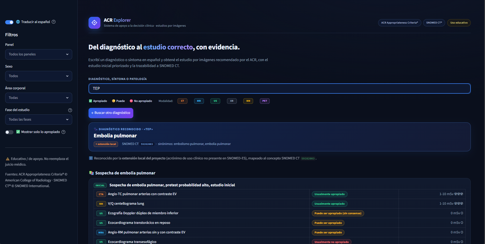
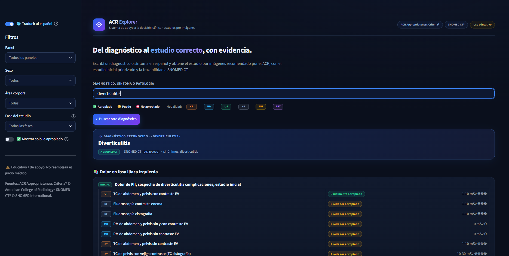

# 🩻 ACR Explorer · Apoyo a la decisión de estudios por imágenes

[](https://github.com/manittaantonio3-bot/acr-explorer/actions/workflows/ci.yml)
[](https://www.python.org/)
[](LICENSE)
[]()

> **Escribí un diagnóstico en español y obtené el estudio por imágenes recomendado
> según los _ACR Appropriateness Criteria®_.** Un puente entre la terminología
> clínica (SNOMED CT) y la evidencia de adecuación del ACR, en español.

> ⚠️ **HERRAMIENTA EDUCATIVA / PROTOTIPO. NO es un dispositivo médico. NO debe
> usarse para decisiones clínicas reales.** Requiere validación profesional.

---

## 🎯 El problema que resuelve

Los **ACR Appropriateness Criteria** son el estándar de referencia para decidir
qué estudio por imágenes pedir, pero:
1. Están **en inglés**.
2. Están indexados por **presentación/escenario**, no por **diagnóstico**.

Si un médico escribe *"angor"*, una búsqueda de texto da **0 resultados** (el ACR
dice "chest pain", "coronary artery disease"). Este proyecto **mapea el
diagnóstico → concepto SNOMED → tópico ACR → estudio apropiado**, en español.

```
"angor"  →  Angina de pecho (SNOMED 194828000)
         →  Dolor torácico - posible síndrome coronario agudo
         →  Angio-TC coronaria / Cinecoronariografía…  ✅ apropiado
```

## ✨ Características

- 🔎 **Buscador inteligente**: diagnóstico en texto libre (vía SNOMED) o búsqueda
  de síntoma/patología en los criterios.
- 🩺 **Dx → Estudio explicable**: muestra qué entendió, el código SNOMED y por qué.
- 🟢 **Estudio inicial priorizado**: separa lo que se pide *primero* (initial
  imaging) de los estudios de *seguimiento*, con un filtro por fase.
- 🏷️ **Procedencia trazable**: cada interpretación se marca como SNOMED CT oficial,
  variante lingüística o extensión local (acrónimos como TEP/HSA atados a su
  concepto SNOMED real) — total transparencia.
- 🌐 **Traducción médica al español** (~98% de cobertura, validada contra el
  vocabulario español de SNOMED — no es traducción literal).
- 🧬 **Cobertura por jerarquía SNOMED** (↑ ancestros + ↓ descendientes): 175
  diagnósticos ancla → **18.278 conceptos** (cualquier subtipo resuelve solo,
  ej. "leucemia mieloide aguda").
- 🗂️ **Explorador completo** de los 4115 escenarios ACR con filtros.
- ✅ **Triple validación**: integridad vs ACR en vivo, conceptos SNOMED activos,
  y concordancia clínica con la guía **SAR** (Sociedad Argentina de Radiología).
- ⚡ **Rápido**: traducciones e índices cacheados (búsqueda instantánea).

## 📊 En números

| | |
|---|---|
| Escenarios ACR | **4.115** (13 paneles) |
| Filas procedimiento-rating | **52.815** |
| Tópicos ACR curados al español | **270 / 270** |
| Tópicos con diagnóstico SNOMED mapeado | **174 / 270** |
| Diagnósticos mapeados (anclas) | **175** |
| Conceptos SNOMED cubiertos (jerarquía ↑↓) | **18.278** |
| Sinónimos en español indexados | **27.402** |
| Cobertura de traducción | **~98%** |

> **Validado:** integridad ACR (130 escenarios, 0 diferencias vs sitio en vivo) ·
> conceptos SNOMED (175/175 coherentes, 0 inactivos) · concordancia clínica con la
> guía **SAR** en las decisiones núcleo. Ver
> [`tools/verificar_integridad.py`](tools/verificar_integridad.py),
> [`tools/verificar_snomed.py`](tools/verificar_snomed.py) y
> [VALIDACION_CLINICA.md](VALIDACION_CLINICA.md).

## 🧬 ¿Por qué SNOMED CT? (no es un buscador de texto)

Cruzar con SNOMED CT —el estándar clínico internacional— es lo que hace al motor
**escalable, interoperable y defendible**:

1. **Sinónimos gratis y en español.** Cada concepto ya trae todas sus formas de
   decirlo. Anclás *un* concepto y heredás sus sinónimos (≈27.000 en total) sin
   tipearlos: "angor", "angina de pecho", "insuficiencia coronaria" → un solo Dx.
2. **La jerarquía como multiplicador.** SNOMED sabe que *"leucemia mieloide aguda"
   ES-UNA "leucemia"*. Anclás 175 diagnósticos y **resuelven 18.278 conceptos**:
   cualquier subtipo que ni cargaste cae solo en su tópico.
3. **Interoperabilidad.** Como cada Dx resuelve a un `conceptId` (ej. `59282003`),
   el motor puede enchufarse a una **historia clínica electrónica** (HL7 FHIR): el
   HCE ya guarda el diagnóstico como código SNOMED → la app sugiere el estudio
   **sin que el médico escriba nada**.

> Sin SNOMED sería un Excel de sinónimos. Con SNOMED es un motor que entiende
> conceptos, escala por jerarquía y habla el idioma de los sistemas clínicos.

## 🖼️ Capturas

### Portada
Buscador unificado: escribís un diagnóstico o síntoma en español.



### Diagnóstico → estudio recomendado
Obtenés el estudio inicial priorizado, con el código SNOMED y la procedencia
de la interpretación (SNOMED CT / variante / extensión local).



### Explorador de los 4115 escenarios
Búsqueda y filtros (panel, sexo, área corporal, fase) sobre todo el catálogo ACR.


---

## 🏗️ Arquitectura

```
core/
  motor.py          Motor de reglas de los criterios curados
  consulta_acr.py   Consulta + búsqueda bilingüe del dataset ACR
  traduccion.py     Traductor médico EN→ES (glosario curado)
  diagnostico.py    Resolver Dx → SNOMED → tópico ACR → estudios
data/
  topicos_es.py     270 tópicos ACR curados al español
  anclas_terminos.py 175 diagnósticos → tópicos ACR (curado a mano)
  crosswalk_acr.py  Carga el crosswalk resuelto (Dx → SNOMED → tópico)
  extension_local.py Alias locales (TEP, HSA…) atados a conceptId SNOMED + variantes
  criterios_acr.py  11 patologías de guardia con criterio propio
tools/
  importar_portal_acr.py  Importa los 4115 escenarios del ACR AC Portal
  importar_acr.py         Importa el catálogo clásico (acsearch)
  importar_snomed.py      anclar (Dx→concepto) + extraer (jerarquía IS-A ↑↓ + sinónimos)
  verificar_integridad.py Audita los datos locales vs ACR en vivo
  verificar_snomed.py     Valida que cada concepto SNOMED esté activo y sea correcto
app_streamlit.py    Interfaz web (buscador unificado Dx/texto)
tests/              Tests automatizados (motor, traducción, diagnóstico)
```

El diseño separa **datos** ↔ **lógica** ↔ **interfaz**. La capa de traducción es
**no destructiva**: nunca modifica los datos fuente (solo traduce al renderizar).

---

## 🚀 Cómo correrlo

> El repositorio incluye el **código**, no los datos (ver licencias abajo).
> Necesitás obtener tus propios datos del ACR y SNOMED.

### 1. Instalar
```bash
pip install -r requirements.txt
```

### 2. Obtener datos (ver "Obtención de datos")
```bash
python tools/importar_portal_acr.py lista        # índice de escenarios ACR
python tools/importar_portal_acr.py extraer --all # detalle (procedimientos+ratings)
python tools/importar_snomed.py anclar --rf2 <ruta_RF2_SNOMED>
python tools/importar_snomed.py extraer --rf2 <ruta_RF2_SNOMED>
```

### 3. Ejecutar
```bash
streamlit run app_streamlit.py
```

### Tests
```bash
python -m pytest -q
```

---

## 📥 Obtención de datos (vos, con tu licencia)

| Fuente | Cómo obtenerla |
|---|---|
| **ACR Appropriateness Criteria®** | Sitio oficial: <https://acsearch.acr.org> y <https://gravitas.acr.org/ACPortal>. Los importadores los descargan para **consulta**. Sujeto a los términos del ACR. |
| **SNOMED CT®** | Gratis en países miembros. En Argentina: [Centro Nacional de Terminología en Salud](https://www.argentina.gob.ar/salud/terminologia) o [MLDS](https://mlds.ihtsdotools.org). Se usa el release RF2 (edición en español). |

---

## ⚖️ Aviso legal y atribución

- **Educativo / prototipo.** No es un dispositivo médico (no cumple IEC 62304 ni
  marco regulatorio de software médico). No reemplaza el juicio profesional.
- **ACR Appropriateness Criteria®** © American College of Radiology. Marca y
  contenido del ACR; este proyecto los cita como referencia, no está avalado por
  el ACR.
- **SNOMED CT®** © SNOMED International. Uso bajo licencia.
- Código bajo [MIT](LICENSE). Los **datos no se redistribuyen** (ver `.gitignore`).

Ver [METODOLOGIA.md](METODOLOGIA.md) para cómo se construyó y validó.

---

## 👤 Autor

Antonio Manitta — médico + desarrollo de software.
Proyecto personal / portfolio. Feedback y colaboración bienvenidos.
